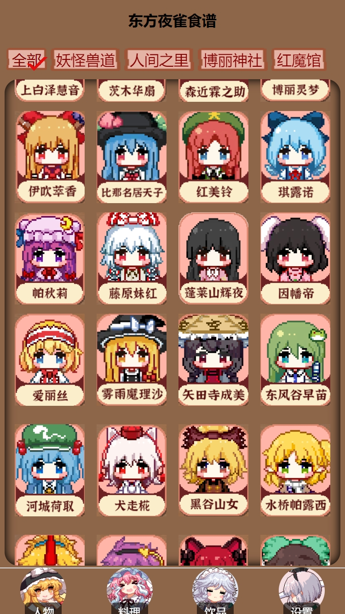
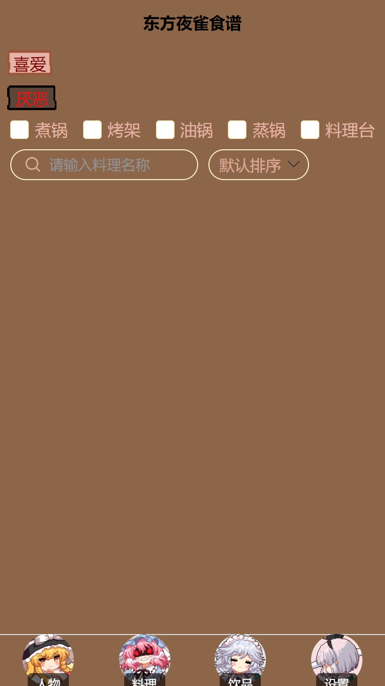
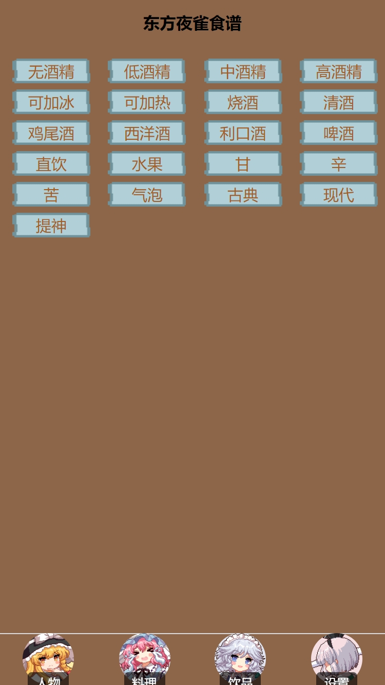

# 简介

Greetings!

开发中，一会儿补上

## 当前进度预览

以下是当前开发进度的预览图：
完成了人物-料理-饮品-设置四大界面的界面ui设计和导航栏页面跳转逻辑  
封装导入了npc.js预览信息，完成“点击头像跳转对应人物详情界面”的页面逻辑  
完成人物详情界面的ui设计，信息排版和简单信息读取展示  
完成了料理、饮品页面筛选搜索的条目ui设计和交互动画  
完成了设置页面应用重启按键  

  
  
  
  
  

  

## 未来进度计划  

以下是未来进度规划：  
1.完成料理、饮品界面的预览信息导入  
2.完成人物详情界面更丰富信息的导入、排版、ui设计  
3.完成人物、料理、饮品界面的标签筛选显示逻辑  
4.完成料理界面的搜索、排序显示逻辑  
5.添加人物详情的特殊信息，如符卡、羁绊、推荐食物与饮品等  

## 关注千早爱音喵！ 关注anon tokyo谢谢喵！

  

